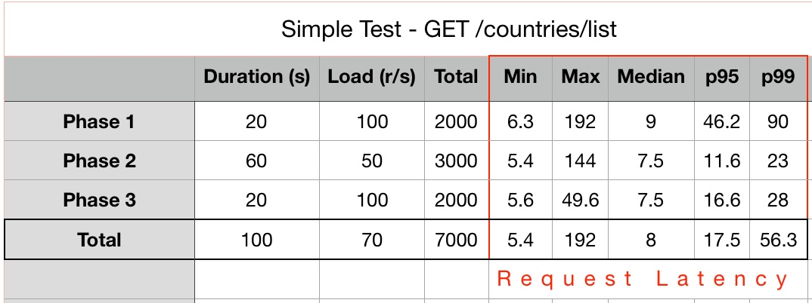
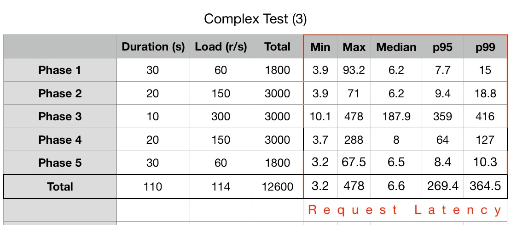

# The World Right Now - Back-end

[](https://travis-ci.org/kris71990/the_world_right_now)

[]( https://github.com/kris71990/the_world_right_now)

[](https://github.com/kris71990/the_world_right_now)


**Author: Kris Sakarias**

**Version: 2.0.0**

## Overview

This is a full-stack application that informs the user about the current social, political, and economic state of the countries in the world. 

The back-end server and APIs are built with ***Node***, ***Express***, and ***MongoDB***. All data is courtesy of the CIA World Factbook API (https://github.com/iancoleman/cia_world_factbook_api#data). This data comes in the form of a single very large JSON object, which the app utilizes to perform its basic CRUD functionality. The server does a very large amount of parsing and validation to a ensure a smooth and accurate user experience.

The server is composed of a REST API and a ***GraphQL*** API, for purposes of targeted data fetching.

Political and electoral information is also examined. A country's political system page allows the user to see the type of government, the current leaders (with pictures), future elections, and much more.


## Documentation

**Create an .env file**

Include these environment variables to run the application

```
NODE_ENV=development
PORT=3000
MONGODB_URI=mongodb://localhost/worldleaders
CLIENT_URL=http://localhost:8080
```

**Starting the Server**:

`git clone https://github.com/kris71990/the_world_right_now.git`

`cd front-end` `npm i` 

`cd back-end` `npm i`

`mongod`

`/back-end` `npm run start`

`/front-end` `npm run watch`


**Database Models**:

There are two models controlling the structure of the data in the back-end

```
Country
System
```

Any country in the world can be stored in the country collection of the Country model. A system can only be created for a country that exists in the country collection (1:1 relationship). Each system holds a unique reference number to the country it represents. 

The GraphQL schemas reflect these data models. The GraphQL server is a wrapper around the REST API - it calls the REST routes, and serves them to the frontend based on the data requested by the frontend. This prevents overfetching and underfetching for various functions of the app. 

**Back-end Functionality**:

*Country Router*

1. POST to /countries
    - Required Parameters
      - `countryName` - the name of some country in the world (use quotes for multiple words)
    - Example request 
       - `http POST localhost:${PORT}/countries countryName=benin`
    - The above request will retrieve and parse data from the CIA world factbook for Benin, save the relevant data into the database, and return the saved data.

2. GET from /countries/:id
    - Required Parameters
      - `id` - the id of some country currently in the database
    - Example request 
      - `http GET localhost:${PORT}/countries/5b130b049fe61724b1d83609`
    - The above request will return the country with the given id from the database, if it exists.

3. GET from /countries/all
    - No required parameters
    - Example request
      - `http GET localhost:${PORT}/countries/all`
    - Returns a JSON object with all information for every country in the database

4. GET from /countries/list
    - No required parameters
    - Example request
      - `http GET localhost:${PORT}/countries/list`
    - Returns a filtered version of /countries/all, an array of all countries in the system with only the countryName and id. This keeps the front end cleaner for the purposes of rendering the landing page.

5. PUT to /countries/:id
    - Required Parameters
      - `id` - the id of some country currently in the database
    - Example request
      - `http POST localhost:${PORT}/countries/5b130b049fe61724b1d83609`
     - The above request will find the country in the database and check if it is the most recent information. If there is more recently updated info from the world factbook, the country is updated with the new information and returned.

6. DELETE /countries/:id
    - Required parameters
      - `id` - the id of the country to be deleted
    - Example request
      - `http DELETE localhost:${PORT}/countries/5b130b049fe61724b1d83609`
    - This endpoint is rarely needed and validation for it will not succeed unless the country requested to be deleted has also been deleted from the CIA world factbook. 


*System Router*

1. A POST to /system
    - Required Parameters
      - `countryName` - the name of some country in the database
      - `countryId` - the Mongo ObjectId of the country in the database
    - Example request 
      - `http POST localhost:${PORT}/system countryName=benin countryId=5b130b049fe61724b1d83609`
    - The above request will verify that the Benin currently exists in the 'country' collection in the database, and that it does not already reference an existing governmental system. If Benin exists without reference to a system, the post will retrieve and parse Benin's governmental system data and save it to the database, with reference to Benin's entry in the 'country' collection.

2. A GET from /systems-all
    - No required parameters
    - Example Request
      - `http POST localhost:${PORT}/systems-all`
    - The above request filters and parses the typeOfGovernment property on every country in the database, and returns a single object that holds the final tallies for each type of governmental system in existence. 

3. A GET from /system/:country
    - Required Parameters
       - `country` - the name of some country currently in the database
    - Example request 
       - `http GET localhost:${PORT}/system/benin`
    - The above request will return the governmental system data for Benin.

4. A PUT to /system/:country
    - Required Parameters
       - `country` - the name of some country currently in the database
    - Example request 
       - `http PUT localhost:${PORT}/system/benin`
    - The above request will check if what exists in the database is the most current data from the CIA World Factbook. If so, it merely returns the same data. If not, it updates and returns the newest data.

*Photo Router*

1. A POST to /photos/flags
    - Required Parameters
      - `flagUrl` - the url of a photo of the appropriate country's flag.
        - This url must:
          - begin with `https://upload.wikimedia.org/`
          - include `Flag_of`
          - include name of the country 
          - end in `.jpg`, `.png`, or `.svg`
          - Example: `https://upload.wikimedia.org/wikipedia/commons/f/fa/Flag_of_the_People%27s_Republic_of_China.svg`
      - `systemId` - id associated with the system (the front end takes care of this)
    - The server will save and return the new system object  

2. A POST to /photos/hog
    - Required Parameters
      - `leaderUrl` - the url of a photo of the country's head of government.
        - This url must:
          - begin with `https://upload.wikimedia.org/`
          - include the name of the head of government
          - end in `.jpg`, `.png`, or `.svg`
          - Example: `https://upload.wikimedia.org/wikipedia/commons/e/e3/Emmanuel_Macron_in_Tallinn_Digital_Summit._Welcome_dinner_hosted_by_HE_Donald_Tusk._Handshake_%2836669381364%29_%28cropped_2%29.jpg`
      - `systemId` - id associated with the system (the front end takes care of this)
    - The server will save and return the new system object  

3. A POST to /photos/hos
    - Required Parameters
      - `leaderUrl` - the url of a photo of the country's head of state.
        - This url must:
          - begin with `https://upload.wikimedia.org/`
          - include the name of the head of state
          - end in `.jpg`, `.png`, or `.svg`
          - Example: `https://upload.wikimedia.org/wikipedia/commons/e/e3/Emmanuel_Macron_in_Tallinn_Digital_Summit._Welcome_dinner_hosted_by_HE_Donald_Tusk._Handshake_%2836669381364%29_%28cropped_2%29.jpg`
      - `systemId` - id associated with the system (the front end takes care of this)
    - The server will save and return the new system object  


*Rankings Router*

1. A GET from /rankings-gdp
    - Example Request
      - `http GET localhost:${PORT}/rankings-gdp`
    - The above request will filter, sort, and return an array of all countries in the database in descending order of GDP PPP.

2. A GET from /rankings-population
    - Example Request
      - `http GET localhost:${PORT}/rankings-population`
    - The above request will filter, sort, and return an array of all countries in the database in descending order of population.

3. A GET from /rankings-language-prevalence
    - Example Request
      - `http GET localhost:${PORT}/rankings-language-prevalence`
    - The above request will filter, sort, and return an array of all languages spoken in countries in the database, with the number of countries each is spoken in, in descending order. 

4. A GET from /rankings-area
    - Example Request
      - `http GET localhost:${PORT}/rankings-area`
    - The above request will filter, sort, and return an array of all countries in the database in descending order of area.

## Testing

*Unit Testing*

All the functionality in the app is tested using the Jest library. 98% of server-side code is covered with these unit tests. 

To run unit tests: `npm run test`


*Load Testing*

Basic load testing with artillery.io has also been conducted at varying rates and durations for the following:

  Simple tests:
  - `GET /countries/list` - Homepage route
  - `POST /countries countryName="COUNTRY_NAME"` - Creating a country
  - `GET /rankings/gdp` - Generic rankings request
  - `GET /countries/"COUNTRY_ID"` - View a country's information page
  
  Complex:
  - `POST /countries countryName="COUNTRY_NAME"`
    `GET /countries/list`
    `GET /rankings/gdp`

  Sample test data:

  
-------------------------------
  
